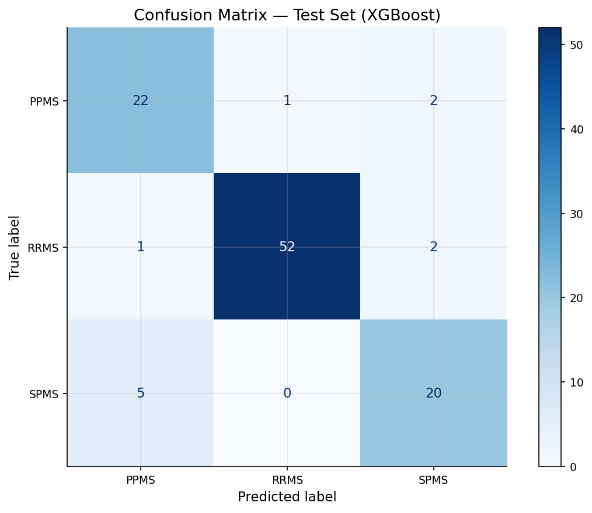
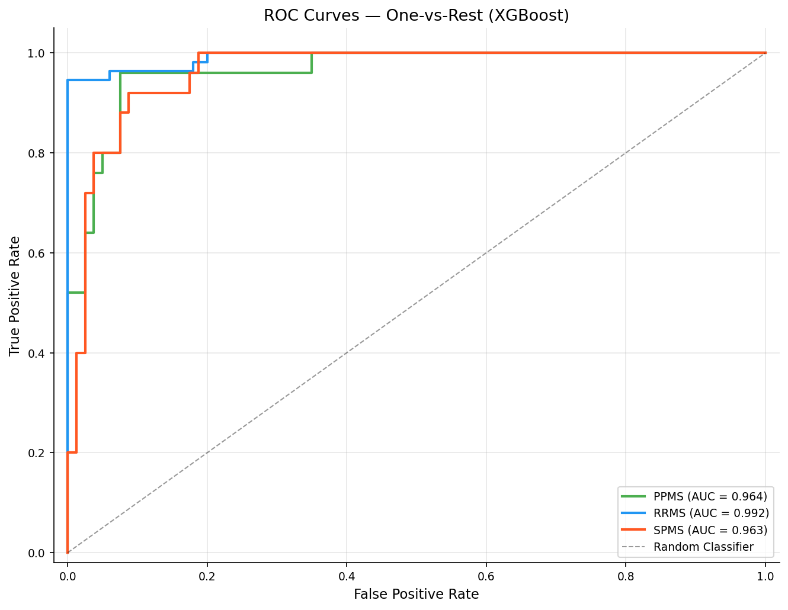
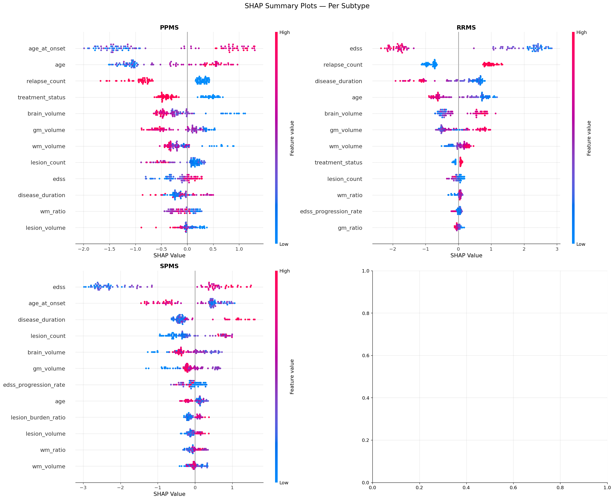
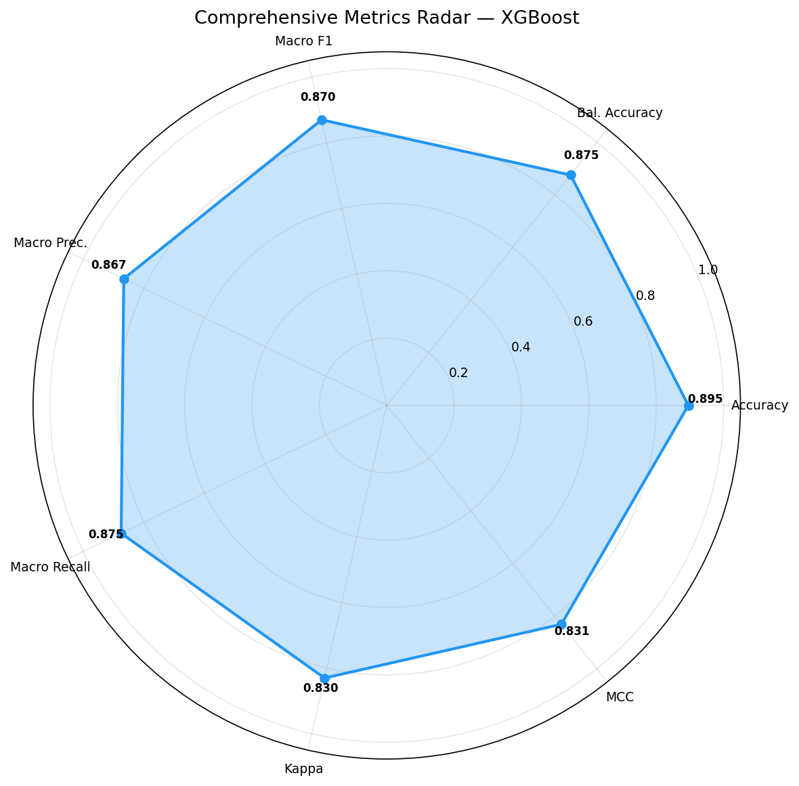

<p align="center">
  
  
  
  
  
</p>

#  Explainable AI for Multiple Sclerosis Subtype Classification

> An advanced ensemble machine learning pipeline with dual Explainable AI (SHAP + DiCE) for transparent, multi-class classification of MS subtypes (RRMS, SPMS, PPMS).

---

##  Abstract

Multiple Sclerosis (MS) is a complex, chronic autoimmune disease of the central nervous system affecting over 2.8 million people worldwide. Accurate classification of its subtypes — **Relapsing-Remitting (RRMS)**, **Secondary Progressive (SPMS)**, and **Primary Progressive (PPMS)** — is critical for determining appropriate therapeutic interventions.

This project develops a comprehensive ML pipeline that:
- Achieves **89.52% accuracy** using XGBoost ensemble learning
- Provides **transparent feature attribution** via SHAP (SHapley Additive exPlanations)
- Generates **actionable "what-if" scenarios** via DiCE (Diverse Counterfactual Explanations)
- Bridges the gap between high-performance AI and clinical interpretability

---

##  Key Results

| Metric | Score |
| :--- | :--- |
| **Accuracy** | 89.52% |
| **Macro F1-Score** | 0.8698 |
| **ROC-AUC (OvR)** | 0.9730 |
| **Cohen's Kappa** | 0.8304 ("Almost Perfect") |
| **5-Fold CV Accuracy** | 0.9095 ± 0.0416 |

### Model Comparison

| Model | Accuracy | Macro F1 | Weighted F1 | ROC-AUC |
| :--- | :--- | :--- | :--- | :--- |
| Logistic Regression | 85.71% | 0.8270 | 0.8581 | 0.9674 |
| Random Forest | 89.52% | 0.8655 | 0.8961 | 0.9697 |
| Extra Trees | 88.57% | 0.8521 | 0.8815 | 0.9638 |
| CatBoost | 88.57% | 0.8569 | 0.8872 | 0.9661 |
| **XGBoost** | **89.52%** | **0.8698** | **0.8964** | **0.9730** |

---

##  Visual Results

<p align="center">
  
  
</p>
<p align="center"><em>Left: Confusion Matrix | Right: Multi-class ROC Curves</em></p>

<p align="center">
  
</p>
<p align="center"><em>SHAP Summary Beeswarm Plot — Per-class Feature Attribution</em></p>

<p align="center">
  
</p>
<p align="center"><em>Comprehensive Evaluation Metrics Radar Chart</em></p>

---

##  System Architecture

```
┌─────────────────────────────────────────────────────────────────┐
│                    INPUT: Patient Clinical Data                  │
│         (16 Features: Demographics + Clinical + MRI)            │
└──────────────────────────┬──────────────────────────────────────┘
                           ▼
┌─────────────────────────────────────────────────────────────────┐
│                   DATA PREPROCESSING                            │
│  • Median Imputation  • Z-Score Scaling  • Feature Engineering  │
│  • Stratified Split (80/20)  • Class Balancing (Sample Weights) │
└──────────────────────────┬──────────────────────────────────────┘
                           ▼
┌─────────────────────────────────────────────────────────────────┐
│               ENSEMBLE MODEL TRAINING                           │
│  Logistic Regression │ Random Forest │ Extra Trees              │
│  CatBoost            │ XGBoost (Selected)                       │
└──────────────────────────┬──────────────────────────────────────┘
                           ▼
┌─────────────────────────────────────────────────────────────────┐
│              EXPLAINABLE AI PIPELINE                            │
│                                                                 │
│  ┌─────────────────┐          ┌──────────────────────┐         │
│  │   SHAP           │          │   DiCE                │         │
│  │   "WHY was this  │          │   "WHAT needs to      │         │
│  │    predicted?"   │          │    change?"           │         │
│  │                  │          │                       │         │
│  │  • Global Feature│          │  • Counterfactual     │         │
│  │    Importance    │          │    Scenarios          │         │
│  │  • Local Patient │          │  • Minimum Clinical   │         │
│  │    Explanations  │          │    Interventions      │         │
│  └─────────────────┘          └──────────────────────┘         │
└──────────────────────────┬──────────────────────────────────────┘
                           ▼
┌─────────────────────────────────────────────────────────────────┐
│                OUTPUT: Transparent Diagnostic Report             │
│    Subtype Prediction + Feature Attribution + What-If Scenarios  │
└─────────────────────────────────────────────────────────────────┘
```

---

##  Project Structure

```
ms-subtype-classification-xai/
│
├── ms_dataset.csv                        # Primary dataset (525 patients × 17 columns)
│
├── notebooks/                            # ML model training & evaluation notebooks
│   ├── XGBoost.ipynb                     # Primary model (best performance)
│   ├── Random_Forest.ipynb               # Bagging ensemble model
│   ├── Extra_Trees.ipynb                 # Extremely Randomized Trees
│   ├── CatBoost.ipynb                    # Categorical Boosting model
│   ├── Logistic_Regression.ipynb         # Linear baseline model
│   ├── SHAP_Explainability.ipynb         # SHAP feature attribution analysis
│   └── Counterfactual_Explanations.ipynb # DiCE counterfactual generation
│
├── xai_pipeline/
│   └── XAI_shap_counterfactual.ipynb     # Unified SHAP + DiCE pipeline
│
├── figures/                              # Generated plots & visualizations
│   ├── xgb_*.png                         # Model evaluation charts
│   ├── shap_*.png                        # SHAP explainability plots
│   └── cf_*.png                          # Counterfactual visualizations
│
└── README.md
```

---

##  Dataset Overview

**525 patients** | **16 input features** | **3 target classes**

| Category | Features |
| :--- | :--- |
| **Demographic** | `age`, `sex_encoded`, `age_at_onset` |
| **Clinical** | `edss`, `disease_duration`, `relapse_count`, `treatment_status` |
| **Radiological (MRI)** | `brain_volume`, `gm_volume`, `wm_volume`, `lesion_count`, `lesion_volume` |
| **Engineered** | `edss_progression_rate`, `gm_ratio`, `wm_ratio`, `lesion_burden_ratio` |

### Target Classes
| Subtype | Count | Description |
| :--- | :--- | :--- |
| **RRMS** (Relapsing-Remitting) | 275 (52.4%) | Attacks followed by recovery periods |
| **PPMS** (Primary Progressive) | 125 (23.8%) | Steady worsening from onset |
| **SPMS** (Secondary Progressive) | 125 (23.8%) | Initially RRMS, then steady worsening |

---

##  Installation & Setup

### Prerequisites
- Python 3.9 or higher
- pip package manager

### Steps

```bash
# 1. Clone the repository
git clone https://github.com/Mustaqeemuddin7/ms-subtype-classification-xai.git
cd ms-subtype-classification-xai

# 2. Create a virtual environment
python -m venv venv

# 3. Activate the environment
# Windows:
venv\Scripts\activate
# macOS/Linux:
source venv/bin/activate

# 4. Install dependencies
pip install pandas numpy matplotlib seaborn scikit-learn xgboost catboost shap dice-ml jupyter
```

### Quick Start

```bash
# Launch Jupyter Notebook
jupyter notebook

# Open the main XGBoost notebook
# Navigate to: notebooks/XGBoost.ipynb
```

---

##  Tech Stack

| Technology | Purpose |
| :--- | :--- |
| **Python 3.9+** | Core programming language |
| **Scikit-learn** | ML algorithms, preprocessing, evaluation metrics |
| **XGBoost** | Primary ensemble classification model |
| **CatBoost** | Categorical gradient boosting (comparison) |
| **SHAP** | Game-theoretic feature attribution (TreeExplainer) |
| **DiCE-ML** | Diverse counterfactual explanation generation |
| **Pandas / NumPy** | Data manipulation and numerical computing |
| **Matplotlib / Seaborn** | Statistical visualization |
| **Jupyter Notebook** | Interactive development environment |

---

##  Methodology

### 1. Data Preprocessing
- Missing value imputation using **median strategy**
- **Z-score normalization** (StandardScaler) for continuous features
- **Stratified train-test split** (80/20) to preserve class distribution
- **Balanced sample weights** to handle class imbalance (RRMS overrepresentation)

### 2. Feature Engineering
- `edss_progression_rate` = EDSS / disease_duration (disease velocity)
- `gm_ratio` = gm_volume / brain_volume
- `wm_ratio` = wm_volume / brain_volume
- `lesion_burden_ratio` = lesion_volume / brain_volume

### 3. Model Training
Five algorithms trained and compared:
- **Linear:** Logistic Regression (baseline)
- **Bagging:** Random Forest, Extra Trees
- **Boosting:** XGBoost, CatBoost

### 4. XGBoost Hyperparameters
```python
XGBClassifier(
    objective='multi:softprob',
    n_estimators=300,
    learning_rate=0.1,
    max_depth=5,
    subsample=0.8,
    colsample_bytree=0.8,
    random_state=42
)
```

### 5. Explainability Pipeline
- **SHAP TreeExplainer** → Global & local feature importance
- **DiCE Counterfactuals** → Actionable "what-if" clinical scenarios

---

##  Key Findings

### Top Predictive Biomarkers (identified by SHAP)
1. **EDSS Score** — Most dominant feature; higher scores drive progressive classification
2. **Disease Duration** — Longer duration correlates with progressive states
3. **Lesion Volume** — Primary radiological indicator of disease progression

### Clinical Implications
- The system provides neurologists with **data-driven second opinions**
- SHAP visualizations offer **transparent reasoning** for each diagnosis
- DiCE counterfactuals enable **proactive treatment planning** by showing what clinical changes could alter a patient's trajectory

---

##  Future Enhancements

-  **Deep Learning Integration** — Hybrid CNN + XGBoost for raw MRI scans
-  **Longitudinal Forecasting** — LSTM-based temporal disease trajectory prediction
-  **Multi-Center Validation** — Cross-institutional dataset expansion
-  **Web Dashboard** — Streamlit/Flask-based clinical decision-support interface

---

##  Team

| Name |
| :--- |
| Mohammed Mustafa |
| Syed Atha Ullah Shareef |
| Mohammed Mustaqeem Uddin |

**Guide:** MS. Hajira Sabuhi, Associate Professor

**Institution:** Lords Institute of Engineering and Technology (UGC Autonomous), Hyderabad

---

##  References

1. Walton et al., "Rising prevalence of MS worldwide," *Multiple Sclerosis Journal*, 2020.
2. Lublin et al., "Defining the clinical course of MS: The 2013 revisions," *Neurology*, 2014.
3. Chen & Guestrin, "XGBoost: A scalable tree boosting system," *ACM SIGKDD*, 2016.
4. Lundberg & Lee, "A unified approach to interpreting model predictions," *NeurIPS*, 2017.
5. Mothilal et al., "Explaining ML classifiers through diverse counterfactual explanations," *ACM FAccT*, 2020.
6. Poretto et al., "ML for Prediction of PIRA in MS Patients," 2026.
7. Pérez-Miralles et al., "Predictors of Short-Term Disease Progression in MS," 2024.
8. Pinto et al., "ML in MS diagnosis and prognosis: A comprehensive review," *IEEE RBME*, 2024.

---

##  License

This project is developed as part of the B.E. Mini Project at Lords Institute of Engineering and Technology (A.Y. 2025-2026).

---
 
<p align="center">
  <b>⭐ If you found this project useful, please give it a star!</b>
</p>
